# The Recap AI + AI Automation Mastery n8n Workflows, Templates, and Agents

Collection of n8n agents, workflows, templates, and automations created and maintained by **The Recap AI** — Join our free [AI Automation Community](https://www.skool.com/ai-automation-mastery-group) to connect with AI builders learn how to build

## 📁 Project Organization

The workflows are organized into 5 logical categories based on functionality and interdependencies. Each category includes detailed documentation covering dependencies, third-party services, costs, and setup requirements.

### 🎯 [Marketing Ecosystem](./marketing-ecosystem/) - 8 workflows
Interconnected marketing automation workflows that work together as a comprehensive marketing system.
- **Key Services**: Google Gemini, OpenAI DALL-E 3, HeyGen, Firecrawl
- **Cost Considerations**: Image generation ($0.040-$0.080 per image), video generation (pay-per-minute)

### 📝 [Content Pipeline](./content-pipeline/) - 7 workflows  
Complete content creation pipeline from data ingestion to final content output.
- **Key Services**: Google Gemini, Claude, Firecrawl, Apify, VEO 3, Vizard AI
- **Cost Considerations**: Web scraping (pay-per-request), video processing (pay-per-minute)

### 🤖 [AI Agents Standalone](./ai-agents-standalone/) - 6 workflows
Independent AI agents for specific tasks and domains.
- **Key Services**: Google Gemini, Lovable.dev, Airtop, ElevenLabs, Gmail API
- **Cost Considerations**: Voice processing (pay-per-character), website creation (pay-per-project)

### 🏢 [Business Solutions](./business-solutions/) - 1 workflow
Industry-specific automation solutions for particular business use cases.
- **Key Services**: Google Gemini, Google Calendar API, Google Drive
- **Cost Considerations**: AI processing (pay-per-token), mostly free Google services

### 🔧 [Utility Tools](./utility-tools/) - 6 workflows
Standalone utility workflows that can be used independently or integrated into larger systems.
- **Key Services**: Firecrawl, Apify, Google Gemini, ElevenLabs, Twitter API
- **Cost Considerations**: Web scraping (pay-per-request), social media monitoring (pay-per-monitor)

## 💰 Cost Optimization

### Free Firecrawl Alternatives
Many workflows use Firecrawl API for web scraping. **Free alternatives are available** to reduce costs:
- **n8n HTML Extract Node** (built-in, completely free)
- **Crawl4AI** (open-source, self-hosted)
- **Firecrawl Self-Hosted** (open-source version)
- **GPT-Crawler** (open-source, AI-powered)

📋 **[See detailed migration guide →](./FIRE_CRAWL_ALTERNATIVES.md)**

## Overall System Architecture

```mermaid
graph TB
    subgraph "Marketing Ecosystem"
        ME1[Marketing Team Agent]
        ME2[Content Creation Tools]
        ME3[Repurposing Tools]
        ME4[Research & Analytics]
    end
    
    subgraph "Content Pipeline"
        CP1[Data Ingestion]
        CP2[Content Generation]
        CP3[Content Processing]
        CP4[Distribution]
    end
    
    subgraph "AI Agents Standalone"
        AI1[Web Developer Agent]
        AI2[Gmail Agent]
        AI3[Dental Practice Agent]
        AI4[WhatsApp Chatbot]
    end
    
    subgraph "Business Solutions"
        BS1[Calendar AI Clone]
    end
    
    subgraph "Utility Tools"
        UT1[Web Scraping Tools]
        UT2[Content Analysis Tools]
        UT3[Social Media Tools]
    end
    
    subgraph "Shared Services"
        SS1[Google Gemini]
        SS2[Firecrawl API]
        SS3[Google APIs]
        SS4[OpenAI Services]
        SS5[Third-party APIs]
    end
    
    ME1 --> SS1
    ME2 --> SS4
    ME3 --> SS1
    ME4 --> SS2
    
    CP1 --> SS2
    CP2 --> SS1
    CP3 --> SS1
    CP4 --> SS3
    
    AI1 --> SS1
    AI1 --> SS2
    AI2 --> SS3
    AI3 --> SS1
    AI4 --> SS1
    
    BS1 --> SS1
    BS1 --> SS3
    
    UT1 --> SS2
    UT2 --> SS1
    UT3 --> SS5
    
    style ME1 fill:#e1f5fe
    style CP1 fill:#e8f5e8
    style AI1 fill:#fff3e0
    style BS1 fill:#f3e5f5
    style UT1 fill:#fce4ec
    style SS1 fill:#f5f5f5
```

--- 

## n8n AI Agents

### Marketing Team Voice Agent

[marketing_team_agent.json](https://youtu.be/_HOHQqjsy0U) - AI voice agent to replace your marketing team. Uses ElevenLabs and an n8n agent to handle daily marketing tasks such as writing newsletters, generating images, repurposing content, and creating videos.

- [write_newsletter_tool.json](https://youtu.be/_HOHQqjsy0U) - Automates the entire process of generating an AI-focused newsletter. It collects news, filters and selects top stories, writes engaging summaries and sections in a specific style, and formats the content for email delivery. The tool ensures each newsletter is unique, relevant, and ready for distribution, with built-in quality checks and Slack integration for team review.
- [generate_image_tool.json](https://youtu.be/_HOHQqjsy0U) - Generates custom images using OpenAI’s image generation API, following strict brand guidelines for newsletter and marketing content. The tool takes a prompt and context, applies Recap AI’s visual style rules, and posts the resulting image directly to a Slack channel for the marketing team.
- [generate_talking_avatar_tool.json](https://youtu.be/_HOHQqjsy0U) - Creates a talking avatar video from a provided script using the HeyGen API. The tool generates a video with a selected avatar and voice, waits for processing, checks the video status, and shares the final video link in Slack for the team to use in marketing or social content.
- [repurpose_to_short_form_script_tool.json](https://youtu.be/_HOHQqjsy0U) - Converts newsletter or long-form content into engaging short-form video scripts, optimized for platforms like TikTok, Instagram Reels, and YouTube Shorts. Helps the marketing team quickly generate viral-ready video scripts from existing content.
- [repurpose_to_twitter_thread_tool.json](https://youtu.be/_HOHQqjsy0U) - Transforms newsletter content into a compelling, multi-tweet Twitter/X thread. Automatically distills the most important news and insights into a format designed to drive engagement and discussion on social media.
- [email_research_report_tool.json](https://youtu.be/_HOHQqjsy0U) - Sends detailed research reports via email to team members or stakeholders. Converts markdown research content into formatted HTML and delivers it directly to the specified inbox, streamlining the sharing of deep-dive research and analysis.

### Dental Practice Voice Agent

[dental_practice_voice_agent.json](https://www.youtube.com/watch?v=vQ5Z8-f-xw4) - AI-powered voice agent for dental practices that handles appointment scheduling, checks Google Calendar availability, books appointments, and logs patient details to Google Sheets, all via natural language.

### WhatsApp AI Chatbot Agent

[whatsapp_ai_chatbot_agent.json](https://www.youtube.com/watch?v=IpWx1ubSnH4) - AI-powered WhatsApp chatbot specifically designed for the hospitality industry. This agent handles customer inquiries and provides personalized service recommendations through natural language conversations.

### AI Gmail Agent

[ai_gmail_agent.json](https://www.youtube.com/watch?v=Q1Ytc3VdS5o) - AI-powered Gmail automation agent that processes emails, categorizes messages, drafts responses, and manages email workflows using natural language processing and automation.

### AI Web Developer Agent

[web_developer_agent.json](https://www.youtube.com/watch?v=ht0zdloIHfA) - AI-powered web developer agent that can scrape existing websites, analyze their content and structure, generate comprehensive Product Requirements Documents (PRDs), and automatically build modern, production-ready websites using Lovable.dev.

- [web_develop_agent_tool_scrape_website.json](https://www.youtube.com/watch?v=ht0zdloIHfA) - Scrapes any website using Firecrawl's map and scrape endpoints to extract all content, links, and structure. The tool maps the entire website to discover all pages, then scrapes each page to collect markdown content, making it ready to be analyzed by the agent.
- [web_develop_agent_tool_write_website_prd.json](https://www.youtube.com/watch?v=ht0zdloIHfA) - Analyzes scraped website content and generates comprehensive Product Requirements Documents (PRDs) optimized for AI website builders like Lovable.dev. The tool modernizes website structure, defines visual styles and branding, and creates detailed page-by-page specifications for a complete website redesign.

## n8n AI Workflows & Automations

- [ai_scraping_pipeline.json](https://www.youtube.com/watch?v=2uwV4aUyGIg) - Uses Google News, Firecrawl, and rss.app to scrape virtually any piece of web content and transform it into LLM-ready output.
- [twitter_reply_guy_agent.json](https://www.youtube.com/watch?v=Q_b5uPndsLY) - Uses a Mention.com Twitter / X keyword monitoring feed to monitor incoming Twitter posts for certain keywords then uses AI to evaluate and post a reply.
- [firecrawl_email_scraper.json](https://www.youtube.com/watch?v=zasYpLeMV9g) - Uses firecrawl `/map` and `/scrape` endpoints to scrape all email addresses from a given website.
- [write_seo_optimized_listicle_article.json](https://www.youtube.com/watch?v=uDrkgEuEOBA) - Uses Chat GPT Deep Research output to generate an SEO-optimized article and publish to your CMS.
- [ai_news_data_ingestion.json](https://www.youtube.com/watch?v=Nv5_LU0q1IY) - Automatically ingests and processes AI news content from multiple sources (Google News, AI Subreddits, Hacker News, and more sources) using RSS feeds and evaluates content relevance.
- [ai_newsletter_generator.json](https://www.youtube.com/watch?v=Nv5_LU0q1IY) - Generates AI-focused newsletters by selecting top stories, writing engaging content, and formatting with proper markdown structure.
- [firecrawl_scrape_url.json](https://www.youtube.com/watch?v=Nv5_LU0q1IY) - A reusable workflow that uses Firecrawl to extract the main text content and relevant images from any URL, optimized for content processing and LLM prompting.
- [cal_ai_clone_backend.json](https://www.youtube.com/watch?v=4c-kYOiksFg) - Analyzes meal images using AI to estimate calories and nutrition, then returns results as JSON for your app.
- [veo_3_viral_bigfoot_vlog_generator.json](https://www.youtube.com/watch?v=C65c8itWvf4) - Generates a multi-scene, AI-scripted Bigfoot vlog video from a user idea, gets human approval, and creates the final video using VEO 3.
- [short_form_video_script_generator.json](https://www.youtube.com/watch?v=7WsmUlbyjMM) - Generates a short-form video script using AI based on scraped news stories, optimized for virality and engagement.
- [twitter_x_scraping.json](https://youtu.be/otK0ILpn4GQ) - Multiple approaches to scrape tweets from Twitter/X using Apify, then saves tweet data (ID, URL, text, engagement metrics) to Google Sheets for further analysis or automation.
- [content_repurposing_factory.json](https://www.youtube.com/watch?v=u9gwOtjiYnI) - Repurposes any YouTube video into viral-ready Twitter/X threads and LinkedIn posts using Apify and Claude.
- [reverse_engineer_viral_ai_videos.json](https://youtu.be/qNSBLfb82wM) - Reverse-engineers any Instagram Reel or TikTok into a detailed, shot-by-shot prompt, using Apify and Google Gemini.
- [viral_youtube_video_clipper.json](https://www.youtube.com/watch?v=Yb-mZmvHh-I) - Automatically analyzes any YouTube video, generates up to 8 viral-ready short clips using Vizard AI, filters for the most viral (score greater than 9 out of 10), and shares the best clips with download links to Slack for review and sharing.
- [local_podcast_generator.json](https://www.youtube.com/watch?v=mXz-gOBg3uo) - AI-powered podcast generator that scrapes local event news from RSS feeds, processes the content using Firecrawl, and generates engaging podcast scripts with ElevenLabs v3 audio tags. The workflow creates production-ready audio files for local news briefs, perfect for community-focused content creators.
- [nano_banana_ad_creative_generator.json](https://www.youtube.com/watch?v=TZcn8nOJHH4) - Generates on-brand ad creative using Google's Nano Banana image model (Gemini 2.5 Flash Image)
- [nano_banana_facebook_ad_thief.json](https://youtu.be/QhDxPK2z5PQ) - Scrapes your competitor's best-performing Facebook and Instagram ads and generates new ad creative that features your own product or service (using Nano Banana).
