# AI Agents Standalone

This folder contains independent AI agents that can operate autonomously for specific tasks and domains.

## Workflows Included

### Specialized AI Agents
- **web_developer_agent.json** - AI agent specialized in web development tasks
- **ai_gmail_agent.json** - Gmail automation and email management agent
- **dental_practice_voice_agent.json** - Voice-enabled agent for dental practice management
- **whatsapp_ai_chatbot_agent.json** - WhatsApp chatbot for customer service

### Supporting Tools
- **web_develop_agent_tool_scrape_website.json** - Website scraping tool for the web developer agent
- **web_develop_agent_tool_write_website_prd.json** - Product requirements document generator

## Dependencies & Third-Party Services

### AI/LLM Services
- **Google Gemini 2.5 Pro** - Primary language model for all agents
  - **Cost**: Pay-per-token pricing
  - **Usage**: All agent reasoning, content generation, and decision making

### Web Development Services
- **Lovable.dev** - AI-powered website builder
  - **Cost**: Pay-per-project pricing
  - **Usage**: web_developer_agent.json for website creation
- **Airtop** - Browser automation service
  - **Cost**: Pay-per-minute pricing
  - **Usage**: web_developer_agent.json for browser control

### Web Scraping & Data Collection
- **Firecrawl API** - Professional web scraping service
  - **Cost**: Pay-per-request pricing
  - **Usage**: Website analysis, content extraction
- **Google Drive API** - File storage and management
  - **Cost**: Free tier available, paid plans for more storage
  - **Usage**: Document storage, knowledge base management

### Communication Services
- **Gmail API** - Email management and automation
  - **Cost**: Free
  - **Usage**: ai_gmail_agent.json for email processing
- **WhatsApp Business API** - WhatsApp messaging
  - **Cost**: Pay-per-message pricing
  - **Usage**: whatsapp_ai_chatbot_agent.json
- **Google Calendar API** - Calendar management
  - **Cost**: Free
  - **Usage**: dental_practice_voice_agent.json for appointment scheduling

### Voice & Speech Services
- **ElevenLabs** - Text-to-speech and voice cloning
  - **Cost**: Pay-per-character pricing
  - **Usage**: dental_practice_voice_agent.json for voice responses

### Data Storage & Management
- **Google Sheets API** - Spreadsheet management
  - **Cost**: Free
  - **Usage**: Data logging, patient records, activity tracking
- **Google Docs API** - Document management
  - **Cost**: Free
  - **Usage**: Knowledge base creation, document generation

## Cost Considerations

### High-Volume Operations
- **Voice Processing**: ElevenLabs costs scale with speech generation volume
- **Web Scraping**: Firecrawl costs scale with request volume
- **Website Creation**: Lovable.dev costs per project
- **WhatsApp Messaging**: Costs scale with message volume

### Cost Optimization Tips
- Use free Google services where possible (Gmail, Calendar, Sheets, Docs)
- Cache scraped content to avoid re-scraping
- Batch operations to reduce API call overhead
- Monitor usage through service dashboards

## Agent Capabilities

### Web Developer Agent
- Website analysis and development
- Code generation and review
- Project planning and documentation
- **Dependencies**: Firecrawl API, Lovable.dev, Airtop, Google Gemini

### Gmail Agent
- Email automation and analysis
- Inbox management
- Email content generation
- **Dependencies**: Gmail API, Google Gemini, Google Drive, Google Sheets

### Dental Practice Voice Agent
- Appointment scheduling
- Patient communication
- Practice management automation
- **Dependencies**: Google Calendar API, ElevenLabs, Google Sheets, Google Gemini

### WhatsApp Chatbot
- Customer service automation
- Multi-language support
- Business process integration
- **Dependencies**: WhatsApp Business API, Google Gemini

## Workflow Diagram

```mermaid
graph TD
    A[AI Agents Standalone] --> B[Web Developer Agent]
    A --> C[Gmail Agent]
    A --> D[Dental Practice Voice Agent]
    A --> E[WhatsApp AI Chatbot Agent]
    
    B --> B1[Website Scraping Tool]
    B --> B2[Website PRD Generator]
    B --> B3[Lovable.dev Integration]
    
    B1 --> B1A[Firecrawl API]
    B2 --> B2A[Google Gemini]
    B3 --> B3A[Lovable.dev API]
    B3 --> B3B[Airtop Browser Automation]
    
    C --> C1[Email Analysis]
    C --> C2[Knowledge Base Management]
    C --> C3[Response Generation]
    
    C1 --> C1A[Gmail API]
    C1 --> C1B[Google Gemini]
    C2 --> C2A[Google Drive API]
    C2 --> C2B[Google Sheets API]
    C3 --> C3A[Gmail API]
    
    D --> D1[Appointment Scheduling]
    D --> D2[Voice Processing]
    D --> D3[Patient Management]
    
    D1 --> D1A[Google Calendar API]
    D2 --> D2A[ElevenLabs API]
    D2 --> D2B[Google Gemini]
    D3 --> D3A[Google Sheets API]
    
    E --> E1[Customer Service]
    E --> E2[Multi-language Support]
    E --> E3[Business Integration]
    
    E1 --> E1A[WhatsApp Business API]
    E1 --> E1B[Google Gemini]
    E2 --> E2A[Google Gemini]
    E3 --> E3A[WhatsApp Business API]
    
    style A fill:#e1f5fe
    style B fill:#e8f5e8
    style C fill:#fff3e0
    style D fill:#f3e5f5
    style E fill:#fce4ec
```

## Usage

Each agent is designed to work independently and can be deployed for specific use cases. The web developer agent includes additional tools that enhance its capabilities for web development tasks.

## Setup Requirements

### Required Credentials
- Google Gemini API key
- Gmail OAuth credentials (for Gmail agent)
- Google Calendar API credentials (for dental agent)
- Google Drive API credentials
- Google Sheets API credentials
- Firecrawl API key (for web developer agent)
- Lovable.dev API key (for web developer agent)
- Airtop API key (for web developer agent)

### Optional Credentials
- ElevenLabs API key (for voice features)
- WhatsApp Business API credentials (for WhatsApp agent)
