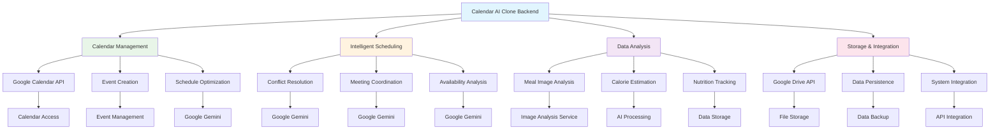

# Business Solutions

This folder contains industry-specific automation solutions designed for particular business use cases.

## Workflows Included

### Calendar & Scheduling Solutions
- **cal_ai_clone_backend.json** - AI-powered calendar management system backend

## Dependencies & Third-Party Services

### AI/LLM Services
- **Google Gemini 2.5 Pro** - Primary language model for calendar intelligence
  - **Cost**: Pay-per-token pricing
  - **Usage**: Schedule optimization, conflict resolution, meeting analysis

### Calendar & Scheduling Services
- **Google Calendar API** - Calendar management and integration
  - **Cost**: Free
  - **Usage**: Calendar access, event creation, scheduling management

### Data Processing & Analysis
- **Custom Image Analysis** - Meal and nutrition analysis
  - **Cost**: Varies by implementation
  - **Usage**: cal_ai_clone_backend.json for calorie estimation

### Storage & Data Management
- **Google Drive API** - File storage and management
  - **Cost**: Free tier available, paid plans for more storage
  - **Usage**: Document storage, data persistence

## Cost Considerations

### High-Volume Operations
- **AI Processing**: Token costs scale with calendar analysis volume
- **Image Processing**: Costs depend on image analysis service used

### Cost Optimization Tips
- Use free Google Calendar API for basic operations
- Cache analysis results to avoid reprocessing
- Batch calendar operations when possible

## Solution Overview

### Calendar AI Clone Backend
This workflow provides a comprehensive backend system for AI-powered calendar management, including:
- Intelligent scheduling optimization
- Meeting coordination
- Calendar integration
- Automated conflict resolution
- Meal image analysis and calorie estimation

## Use Cases

- **Enterprise Calendar Management** - Large organizations needing intelligent scheduling
- **Service-Based Businesses** - Companies requiring appointment optimization
- **Remote Teams** - Distributed teams needing coordination assistance
- **Health & Fitness Apps** - Applications requiring meal analysis and calorie tracking

## Workflow Diagram

## Integration

This solution is designed to integrate with existing calendar systems and can be extended with additional business logic as needed.

## Setup Requirements

### Required Credentials
- Google Gemini API key
- Google Calendar API credentials
- Google Drive API credentials

### Optional Credentials
- Image analysis service API key (for meal analysis features)
