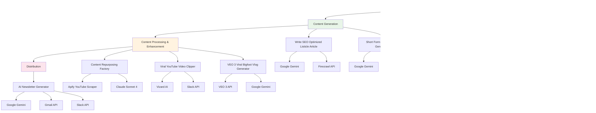

# Content Pipeline

This folder contains workflows that form a complete content creation pipeline from data ingestion to final content output.

## Workflows Included

### Data Ingestion
- **ai_news_data_ingestion.json** - Collects and processes news data from various sources
- **ai_scraping_pipeline.json** - Comprehensive web scraping system for content research

### Content Generation
- **write_seo_optimized_listicle_article.json** - Creates SEO-optimized listicle articles
- **short_form_video_script_generator.json** - Generates scripts for short-form video content

### Content Processing & Enhancement
- **content_repurposing_factory.json** - Main content transformation hub
- **viral_youtube_video_clipper.json** - Creates viral video clips from longer content
- **veo_3_viral_bigfoot_vlog_generator.json** - Generates viral vlog content

### Distribution
- **ai_newsletter_generator.json** - Creates and formats newsletter content

## Dependencies & Third-Party Services

### AI/LLM Services
- **Google Gemini 2.5 Pro** - Primary language model for content generation
  - **Cost**: Pay-per-token pricing
  - **Usage**: Content analysis, article generation, script writing
- **Claude Sonnet 4** - Advanced content processing and analysis
  - **Cost**: Pay-per-token pricing
  - **Usage**: Content repurposing, social media content creation

### Web Scraping & Data Collection
- **Firecrawl API** - Professional web scraping service
  - **Cost**: Pay-per-request pricing (varies by plan)
  - **Usage**: Content extraction, website mapping, batch scraping
- **Apify YouTube Scraper** - YouTube content extraction
  - **Cost**: Pay-per-request pricing
  - **Usage**: content_repurposing_factory.json for video analysis
- **RSS.app** - RSS feed aggregation
  - **Cost**: Free tier available, paid plans for advanced features
  - **Usage**: News feed collection

### Video Processing Services
- **VEO 3 API** - AI video generation
  - **Cost**: Pay-per-minute pricing
  - **Usage**: veo_3_viral_bigfoot_vlog_generator.json
- **Vizard AI** - Video clipping and analysis
  - **Cost**: Pay-per-video pricing
  - **Usage**: viral_youtube_video_clipper.json

### Data Sources
- **Google News** - News aggregation
  - **Cost**: Free
  - **Usage**: ai_news_data_ingestion.json
- **Multiple RSS Feeds** - Content sources including:
  - The Neuron Daily, Futurepedia, Ben's Bites, The Rundown AI
  - **Cost**: Free
  - **Usage**: Newsletter content sourcing

### Storage & Communication
- **Google Drive** - File storage and sharing
  - **Cost**: Free tier available, paid plans for more storage
  - **Usage**: Content storage, file management
- **Slack API** - Team notifications
  - **Cost**: Free for basic usage
  - **Usage**: Content delivery notifications

## Cost Considerations

### High-Volume Operations
- **Web Scraping**: Firecrawl costs scale with request volume
- **Video Processing**: VEO 3 and Vizard costs scale with video length/quantity
- **AI Processing**: Token costs accumulate with content volume

### Cost Optimization Tips
- Use RSS feeds (free) for initial content discovery
- **Replace Firecrawl with free alternatives** (n8n HTML Extract, Crawl4AI, self-hosted Firecrawl)
- Batch scraping operations to reduce API calls
- Cache processed content to avoid reprocessing
- Monitor API usage through service dashboards

### Free Firecrawl Alternatives
- **n8n HTML Extract Node**: Built-in, completely free for basic HTML scraping
- **Crawl4AI**: Open-source, self-hosted alternative with AI integration
- **Firecrawl Self-Hosted**: Open-source version with full functionality
- **GPT-Crawler**: Open-source, AI-powered scraping tool

📋 **[See detailed migration guide →](../FIRE_CRAWL_ALTERNATIVES.md)**

## Workflow Diagram

## Pipeline Flow

1. **Data Collection** → News and web scraping workflows gather raw data
2. **Content Creation** → AI tools transform data into articles and scripts
3. **Content Enhancement** → Repurposing tools optimize content for different formats
4. **Distribution** → Newsletter generator formats and distributes content

## Usage

This pipeline can be run end-to-end for automated content creation, or individual components can be used for specific content needs. The workflows are designed to feed into each other, creating a seamless content production system.

## Setup Requirements

### Required Credentials
- Google Gemini API key
- Claude API key
- Firecrawl API key
- Apify API key
- VEO 3 API key (for video generation)
- Vizard AI API key (for video clipping)

### Optional Credentials
- RSS.app API key (for enhanced feed features)
- Slack webhook URL (for notifications)
- Google Drive API credentials (for file storage)
