# Marketing Ecosystem

This folder contains interconnected marketing automation workflows that work together as a comprehensive marketing system.

## Workflows Included

### Core Marketing Agent
- **marketing_team_agent.json** - Central orchestrator that coordinates all marketing activities

### Content Creation Tools
- **generate_image_tool.json** - AI-powered image generation for marketing materials
- **generate_talking_avatar_tool.json** - Creates talking avatars for video content
- **write_newsletter_tool.json** - Automated newsletter content generation
- **nano_banana_ad_creative_generator.json** - Generates creative ad content
- **nano_banana_facebook_ad_thief.json** - Analyzes and replicates successful Facebook ads

### Content Repurposing Tools
- **repurpose_to_twitter_thread_tool.json** - Converts content into Twitter threads
- **repurpose_to_short_form_script_tool.json** - Creates short-form video scripts

### Research & Analytics
- **email_research_report_tool.json** - Generates research reports from email data

## Dependencies & Third-Party Services

### AI/LLM Services
- **Google Gemini 2.5 Pro** - Primary language model for content generation
  - **Cost**: Pay-per-token pricing (varies by model)
  - **Usage**: All content creation and repurposing workflows
- **Claude Sonnet 4** - Advanced reasoning for complex content tasks
  - **Cost**: Pay-per-token pricing
  - **Usage**: Newsletter generation, content analysis

### Image & Video Generation
- **OpenAI DALL-E 3** - Image generation for marketing materials
  - **Cost**: $0.040 per image (1024x1024), $0.080 per image (1024x1792)
  - **Usage**: generate_image_tool.json
- **HeyGen API** - Talking avatar video generation
  - **Cost**: Pay-per-minute pricing (varies by plan)
  - **Usage**: generate_talking_avatar_tool.json
- **Google Gemini 2.5 Flash Image** - AI image generation (Nano Banana)
  - **Cost**: Pay-per-image pricing
  - **Usage**: nano_banana_ad_creative_generator.json, nano_banana_facebook_ad_thief.json

### Data Sources & APIs
- **Firecrawl API** - Web scraping for content research
  - **Cost**: Pay-per-request pricing
  - **Usage**: Content research and data collection
- **Twitter/X API** - Social media data access
  - **Cost**: Varies by plan (free tier available)
  - **Usage**: Social media content analysis
- **RSS Feeds** - News and content aggregation
  - **Cost**: Free
  - **Usage**: Newsletter content sourcing

### Communication & Storage
- **Slack API** - Team notifications and content sharing
  - **Cost**: Free for basic usage
  - **Usage**: Content delivery and team coordination
- **Gmail API** - Email delivery
  - **Cost**: Free
  - **Usage**: Newsletter distribution, research reports
- **Google Drive** - File storage and sharing
  - **Cost**: Free tier available, paid plans for more storage
  - **Usage**: Content storage and collaboration

## Cost Considerations

### High-Volume Operations
- **Image Generation**: Can be expensive with high volume (DALL-E 3 at $0.040-$0.080 per image)
- **Video Generation**: HeyGen costs scale with video length and quality
- **AI Processing**: Token costs accumulate with content volume

### Cost Optimization Tips
- Use free tiers where possible (Twitter API, Gmail, Google Drive)
- **Replace Firecrawl with free alternatives** (n8n HTML Extract, Crawl4AI, self-hosted Firecrawl)
- Batch operations to reduce API call overhead
- Cache generated content to avoid regeneration
- Monitor usage through service dashboards

### Free Firecrawl Alternatives
- **n8n HTML Extract Node**: Built-in, completely free for basic HTML scraping
- **Crawl4AI**: Open-source, self-hosted alternative with AI integration
- **Firecrawl Self-Hosted**: Open-source version with full functionality
- **GPT-Crawler**: Open-source, AI-powered scraping tool

📋 **[See detailed migration guide →](../FIRE_CRAWL_ALTERNATIVES.md)**

## Workflow Diagram

```mermaid
graph TD
    A[Marketing Team Agent] --> B[Research & Analysis]
    A --> C[Content Creation]
    A --> D[Content Repurposing]
    A --> E[Distribution]
    
    B --> B1[Email Research Report Tool]
    B1 --> B2[Gmail API]
    B1 --> B3[Google Gemini]
    
    C --> C1[Generate Image Tool]
    C --> C2[Generate Talking Avatar Tool]
    C --> C3[Write Newsletter Tool]
    C --> C4[Nano Banana Ad Creative Generator]
    C --> C5[Nano Banana Facebook Ad Thief]
    
    C1 --> C1A[OpenAI DALL-E 3]
    C1 --> C1B[Slack API]
    
    C2 --> C2A[HeyGen API]
    C2 --> C2B[Slack API]
    
    C3 --> C3A[Google Gemini]
    C3 --> C3B[Firecrawl API]
    C3 --> C3C[RSS Feeds]
    
    C4 --> C4A[Google Gemini 2.5 Flash Image]
    C5 --> C5A[Google Gemini 2.5 Flash Image]
    
    D --> D1[Repurpose to Twitter Thread Tool]
    D --> D2[Repurpose to Short Form Script Tool]
    
    D1 --> D1A[Google Gemini]
    D2 --> D2A[Google Gemini]
    
    E --> E1[Slack Notifications]
    E --> E2[Gmail Distribution]
    E --> E3[Google Drive Storage]
    
    style A fill:#e1f5fe
    style B fill:#f3e5f5
    style C fill:#e8f5e8
    style D fill:#fff3e0
    style E fill:#fce4ec
```

## How They Work Together

1. The **Marketing Team Agent** serves as the central coordinator
2. **Research tools** gather data and insights from various sources
3. **Content creation tools** generate marketing materials using AI services
4. **Repurposing tools** adapt content for different platforms
5. All workflows can be triggered by the main agent or run independently

## Usage

These workflows are designed to work as a cohesive marketing automation system. Start with the marketing_team_agent.json as your entry point, or use individual tools as needed for specific marketing tasks.

## Setup Requirements

### Required Credentials
- Google Gemini API key
- OpenAI API key (for image generation)
- HeyGen API key (for video generation)
- Firecrawl API key
- Slack webhook URL
- Gmail OAuth credentials

### Optional Credentials
- Twitter/X API keys (for enhanced social features)
- Google Drive API credentials (for file storage)
