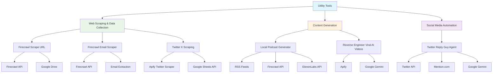

# Utility Tools

This folder contains standalone utility workflows that can be used independently or integrated into larger systems.

## Workflows Included

### Web Scraping & Data Collection
- **firecrawl_scrape_url.json** - General-purpose URL scraping tool
- **firecrawl_email_scraper.json** - Specialized email content extraction
- **twitter_x_scraping.json** - Twitter/X data collection and analysis

### Content Generation
- **local_podcast_generator.json** - Automated podcast content creation
- **reverse_engineer_viral_ai_videos.json** - Analyzes viral AI video patterns

### Social Media Automation
- **twitter_reply_guy_agent.json** - Automated Twitter engagement and responses

## Dependencies & Third-Party Services

### Web Scraping Services
- **Firecrawl API** - Professional web scraping service
  - **Cost**: Pay-per-request pricing (varies by plan)
  - **Usage**: firecrawl_scrape_url.json, firecrawl_email_scraper.json
- **Apify Twitter Scraper** - Twitter/X data extraction
  - **Cost**: Pay-per-request pricing
  - **Usage**: twitter_x_scraping.json

### AI/LLM Services
- **Google Gemini 2.5 Pro** - Content analysis and generation
  - **Cost**: Pay-per-token pricing
  - **Usage**: reverse_engineer_viral_ai_videos.json, twitter_reply_guy_agent.json
- **ElevenLabs** - Text-to-speech for podcast generation
  - **Cost**: Pay-per-character pricing
  - **Usage**: local_podcast_generator.json

### Data Sources
- **RSS Feeds** - News and content aggregation
  - **Cost**: Free
  - **Usage**: local_podcast_generator.json
- **RSS.app** - Enhanced RSS feed processing
  - **Cost**: Free tier available, paid plans for advanced features
  - **Usage**: local_podcast_generator.json

### Social Media APIs
- **Twitter/X API** - Social media data access
  - **Cost**: Varies by plan (free tier available)
  - **Usage**: twitter_reply_guy_agent.json, twitter_x_scraping.json
- **Mention.com** - Social media monitoring
  - **Cost**: Pay-per-monitor pricing
  - **Usage**: twitter_reply_guy_agent.json

### Storage & Data Management
- **Google Sheets API** - Spreadsheet management
  - **Cost**: Free
  - **Usage**: Data storage, results logging
- **Google Drive API** - File storage
  - **Cost**: Free tier available, paid plans for more storage
  - **Usage**: File storage and sharing

## Cost Considerations

### High-Volume Operations
- **Web Scraping**: Firecrawl costs scale with request volume
- **Social Media Scraping**: Apify costs scale with data extraction volume
- **Voice Generation**: ElevenLabs costs scale with speech generation volume
- **AI Processing**: Token costs accumulate with content analysis volume

### Cost Optimization Tips
- Use free RSS feeds for initial content discovery
- Batch scraping operations to reduce API calls
- Cache scraped content to avoid re-scraping
- Use free tiers where possible (Twitter API, Google services)
- Monitor usage through service dashboards

## Tool Categories

### Data Collection Tools
- **Firecrawl Tools** - Professional web scraping with structured data extraction
  - **Dependencies**: Firecrawl API
  - **Cost**: Pay-per-request
- **Twitter Scraper** - Social media data collection and analysis
  - **Dependencies**: Apify Twitter Scraper, Google Sheets API
  - **Cost**: Pay-per-request + free Google services

### Content Analysis Tools
- **Viral Video Analyzer** - Reverse engineers successful AI video content
  - **Dependencies**: Google Gemini, Apify
  - **Cost**: Pay-per-token + pay-per-request
- **Podcast Generator** - Creates podcast content from various sources
  - **Dependencies**: RSS feeds, ElevenLabs, Firecrawl API
  - **Cost**: Pay-per-character (voice) + pay-per-request (scraping)

### Social Media Tools
- **Twitter Reply Agent** - Automated social media engagement
  - **Dependencies**: Twitter API, Mention.com, Google Gemini
  - **Cost**: Varies by plan + pay-per-token

## Usage

These tools are designed to be:
- **Standalone** - Can be used independently for specific tasks
- **Modular** - Can be integrated into larger workflow systems
- **Reusable** - Suitable for multiple use cases and projects

## Workflow Diagram

## Integration

Each tool can be easily integrated into other workflows or used as building blocks for custom automation solutions.

## Setup Requirements

### Required Credentials
- Firecrawl API key (for scraping tools)
- Google Gemini API key (for AI analysis)
- Google Sheets API credentials (for data storage)
- Google Drive API credentials (for file storage)

### Optional Credentials
- Apify API key (for Twitter scraping)
- ElevenLabs API key (for podcast generation)
- Twitter/X API keys (for social media features)
- Mention.com API key (for social media monitoring)
- RSS.app API key (for enhanced feed features)
